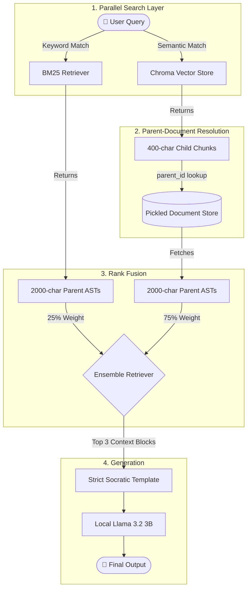

```mermaid
flowchart TB
    Q([👤 User Query])

    subgraph Phase1 [1. Parallel Search Layer]
        Q -->|Keyword Match| BM25[BM25 Retriever]
        Q -->|Semantic Match| Chroma[Chroma Vector Store]
    end

    subgraph Phase2 [2. Parent-Document Resolution]
        Chroma -->|Returns| ChildChunks[400-char Child Chunks]
        ChildChunks -->|parent_id lookup| Store[(Pickled Document Store)]
    end

    subgraph Phase3 [3. Rank Fusion]
        BM25 -->|Returns| P1[2000-char Parent ASTs]
        Store -->|Fetches| P2[2000-char Parent ASTs]
        
        P1 -->|25% Weight| Ensemble{Ensemble Retriever}
        P2 -->|75% Weight| Ensemble
    end

    subgraph Phase4 [4. Generation]
        Ensemble -->|Top 3 Context Blocks| Prompt[Strict Socratic Template]
        Prompt --> LLM[Local Llama 3.2 3B]
        LLM --> Final([🎯 Final Output])
    end
```